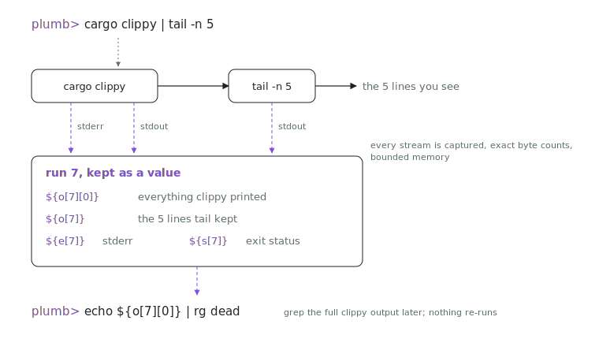

> [!NOTE]
> [`indexable-inc/plumb`](https://github.com/indexable-inc/plumb) is a read-only mirror, generated from [`packages/plumb/cli`](https://github.com/indexable-inc/index/tree/586d336036aec4f4f7661d26f6b918ddffccf51c/packages/plumb/cli) in [`indexable-inc/index`](https://github.com/indexable-inc/index) at commit `586d336036ae`. The monorepo is the source of truth: please open issues and pull requests [there](https://github.com/indexable-inc/index). This mirror is regenerated automatically; anything pushed directly here will be overwritten.

<p align="center">
  <picture>
    <source media="(prefers-color-scheme: dark)" srcset="assets/hero-dark.svg">
    
  </picture>
</p>

# plumb

A simple bash for agents: every step of a pipe is observable.

Agents protect their context window by tailing everything: `cargo test 2>&1 | tail -n 20`. Then the answer turns out to be in the lines tail threw away, so they re-run the whole build. In plumb nothing is thrown away. `tail` still shows 20 lines, but the full stream of every pipe stage is kept and addressable, so the agent greps what it already ran instead of running it again.

```console
plumb> cargo test 2>&1 | tail -n 20
   ...the 20 lines...
[0] cargo test  exit 101  41s (cpu 38s+2s)  out 482KB  err 0B
[1] tail -n 20  exit 0  41s  out 891B  err 0B
run 7: exit 101  ${o[7]} ${e[7]} ${s[7]}

plumb> echo ${o[7][0]} | rg 'FAILED|panicked'    # searches all 482KB; nothing re-runs
```

That is the whole idea:

- `${o[7]}` the final output of run 7; `${o[7][0]}` what pipe stage 0 printed; `${e[7]}` stderr; `${s[7]}` status
- `${o[-1]}` negative indexes count back from the latest run
- `${runs[7].stages[0].stdout_bytes}` structured fields matching the `--json` report: `status`, `argv`, wall and cpu times (`duration_ms`, `user_ms`, `sys_ms`), byte counts
- `:runs` lists runs, `:json 7` dumps one, `:out 7 0` prints a raw stream

Memory stays bounded: each stream keeps head+tail (256KiB default) with exact byte counts, and truncation is always marked, never silent.

## It also removes bash's footguns

- Unset variable expansion is an error (no `rm -rf /$TYPO`)
- A glob matching nothing is an error
- Per-stage exit codes; pipeline status is pipefail (minus SIGPIPE deaths, so `yes | head` succeeds)
- Anything outside the subset (keywords, subshells, backticks, here-docs) is a loud parse error with a span, never a silent reinterpretation

The subset pastes into bash unchanged: pipes, `&&` `||` `;`, redirections (`>` `>>` `<` `2>` `2>&1` `&>` `>&2`), quoting, `$VAR`, `$(...)`, globs, `~`, `NAME=v cmd`, `&` background runs.

## Embed it

```rust
let shell = plumb_core::Shell::new(plumb_core::Config::default())?;
let report = shell.eval("cargo test 2>&1 | tail -n 20")?;   // Report: fully serde-serializable
shell.eval("echo ${o[1][0]} | rg FAILED")?;                  // reuse; nothing re-runs
```

`Shell` is a cloneable handle over shared state, so concurrent evals (threads, `&`) share variables and history. From Elixir, `plumb-ex` exposes the same shell with reports as JSON: `{:ok, json} = Plumb.Shell.eval(shell, "make 2>&1 | tail -5")`. One-shots: `plumb -c '...'` (add `--json` for the report), scripts via `plumb file` or stdin.

## Install

```sh
nix run github:indexable-inc/index#plumb
cargo install --git https://github.com/indexable-inc/plumb
```

The crates live in the [index monorepo](https://github.com/indexable-inc/index) under `packages/plumb/` (`plumb-syntax` parser, `plumb-core` library, `plumb` CLI, `plumb-ex` Elixir NIF); this repo is a read-only mirror.

Changes: [CHANGELOG.md](CHANGELOG.md), derived from the [monorepo history](https://github.com/indexable-inc/index/commits/main/packages/plumb/cli) of the package.
